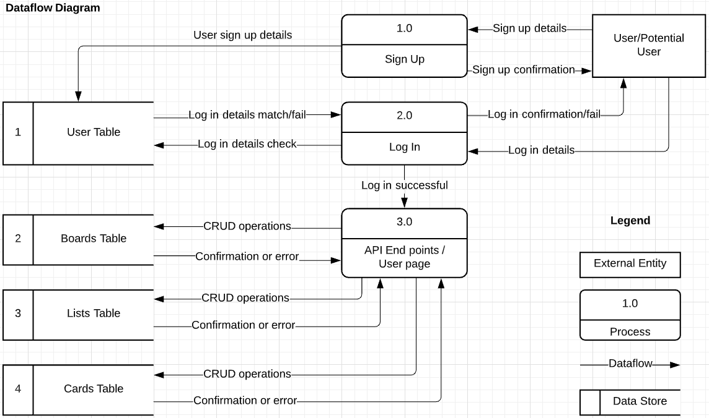
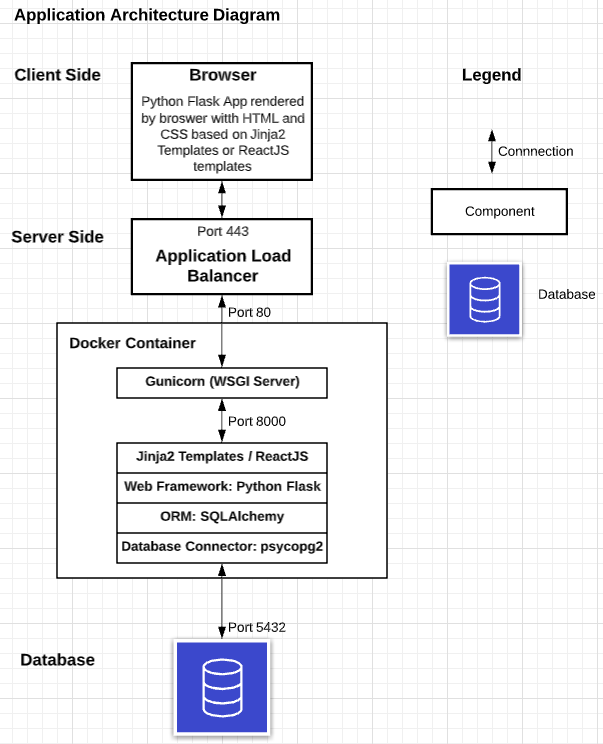
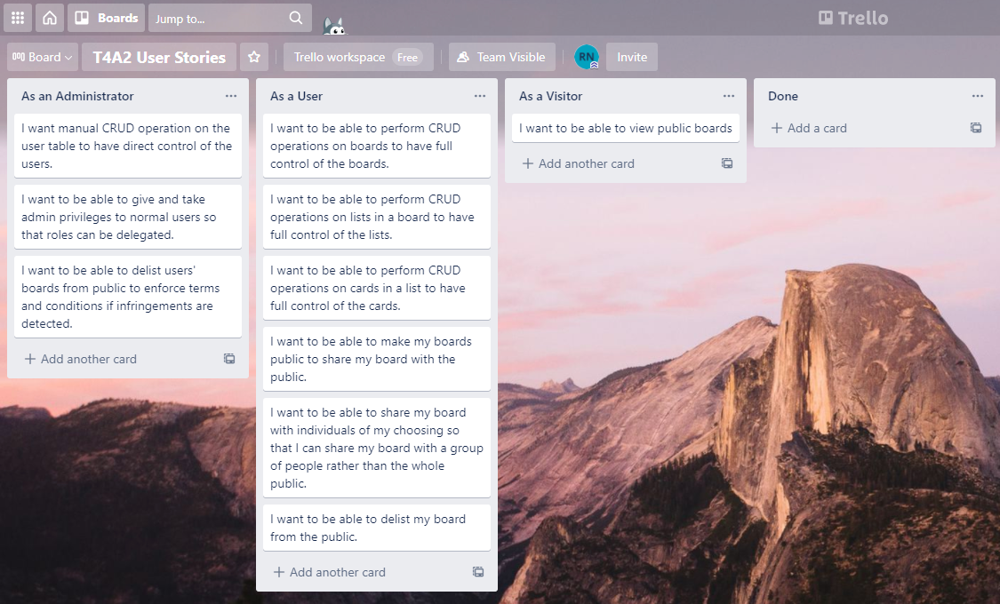
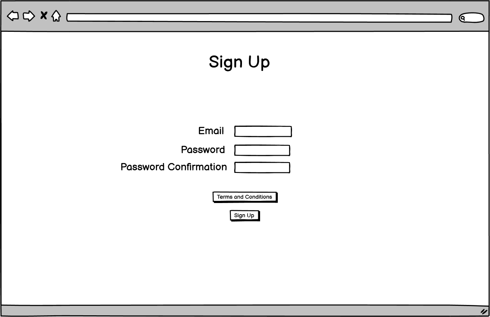
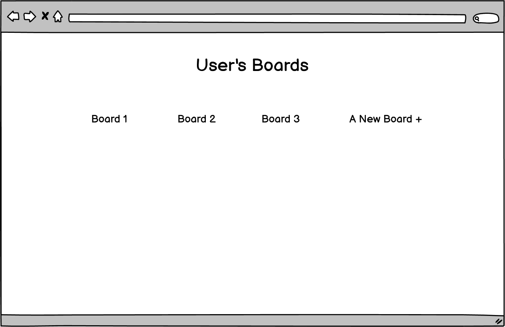
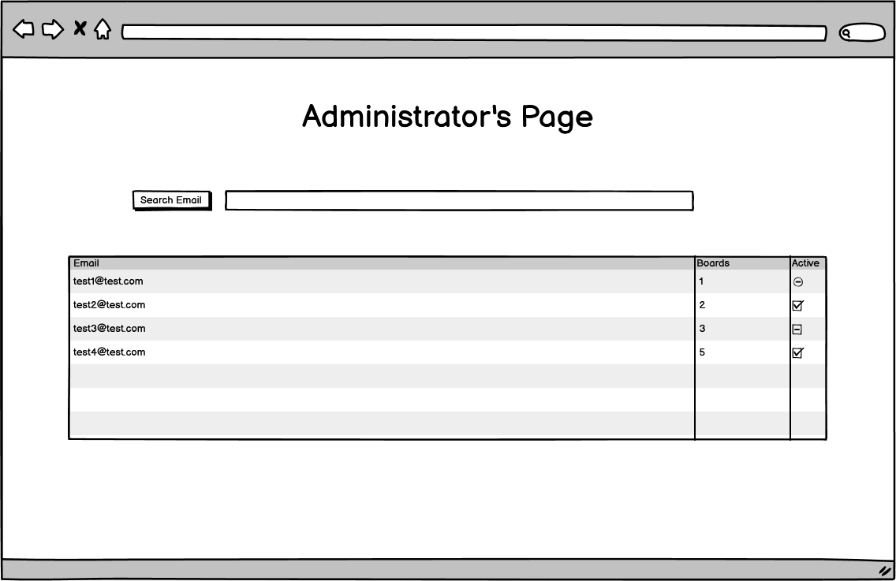
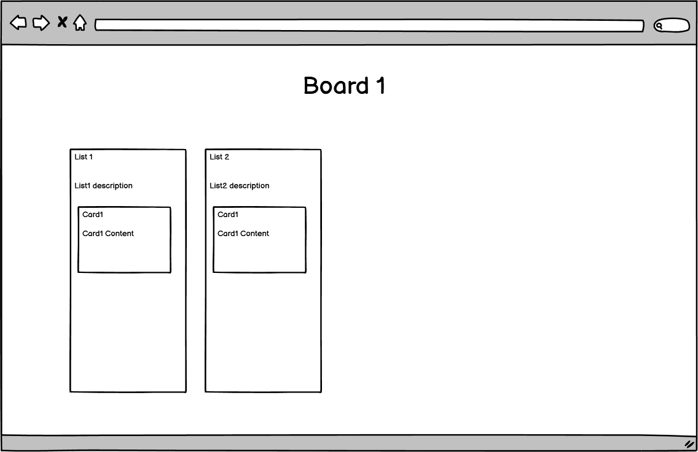
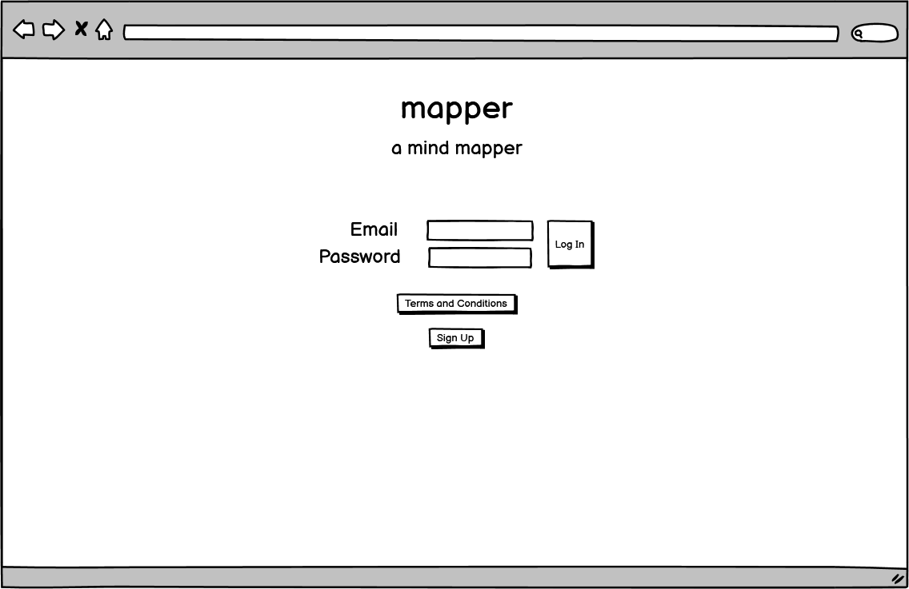
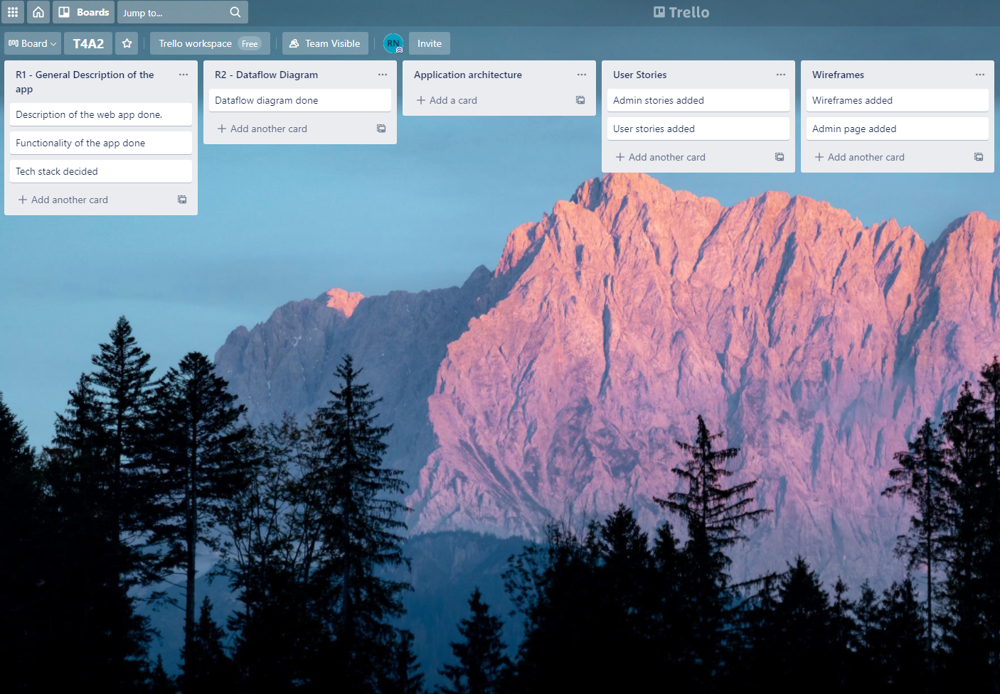

# Mapper

## Setup & Installtion

Make sure you have the latest version of Python installed.

```bash
git clone <repo-url>
```

```bash
pip install -r requirements.txt
```

## Running The App

```bash
python main.py
```

## Viewing The App

Go to `http://127.0.0.1:5000`


https://limitless-scrubland-15817.herokuapp.com/
https://github.com/blah88/mapper2

Disclaimer: The entirety of the content below are subject to change. The app name, purpose, tech stack, dataflow logic, wireframes and user stories may be different in the final stage.  
<br>

## Purpose  
  As a borderline-difunctionally-disorganised person I saw the need for a platform like Trello with the capabilities to make mind maps to organise information. As an attempt to create something similar I came up for the web app 'mapper'.

  The purpose of the web app 'mapper' is to facilitate a platform which allows its users to publish any kind of content of their choosing in an organised way so that the contents uploaded by users are easy to read and easily referred to. The content can be private or public. The key focus is organisation.   


Functionality / features  
1. Sign up, user login, change password
2. CRUD operations on the boards, lists, and cards
3. Make boards private or public
4. Admin CRUD operations on the user table 

<br>

## Target audience  
  Anyone interested in blogging and content creation for the purpose of sharing. Anyone who wants to organise any kind of content. 

<br>

## Tech stack
  PostgreSQL database in AWS RDS
  Python Flask with either Jinja2 templates or ReactJS
  HTML/CSS in Jinja2 or ReactJS templates

<br>

## Dataflow Diagram



<br>

## Application Architecture Diagram



<br>

## User Stories 


<br>

## Wireframes











<br>

## Trello




